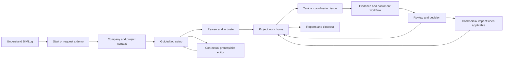

# A connected BIMLog experience

Design proposal, September 2026, revised for [Roberto's September 28 meeting requirements](MEETING-REQUIREMENTS.md). Companion to [the audit](AUDIT.md) and [the 150-microbuild program](MICROBUILDS.md). This document does not authorize product implementation or deployment.

## Product promise

**BIMLog connects the work, decisions and evidence needed to deliver a BIM project.**

Every important screen should answer: What job am I in? What is its current state? What needs my attention? Who acts next? What evidence supports it? Where do I return?

The experience should make a difficult construction workflow understandable without weakening it. A coordinator should not need to learn the application's internal authority vocabulary. An administrator should still be able to inspect permissions, provenance and immutable versions.

## Journey contract: what each screen must make clear

| User's question | Required experience |
|---|---|
| Where am I? | Project, current work item and meaningful page/stage title remain visible. |
| What have I already done? | Saved information and completed stages are evident; no request to repeat known input. |
| What do I do now? | One clear primary action for the current role/state, with optional actions subordinate. |
| Why can I not continue? | Specific missing prerequisite, responsible role and actionable recovery; preserve input. |
| Where does this button take me? | Destination/action label is specific; a detour explains how completion returns to the current work. |
| What changed? | A confirmation names the created/updated record and resulting state without implying approval or delivery that did not occur. |
| How do I go back or stop? | Visible contextual return, safe Cancel and predictable browser navigation; selection/filter/draft preserved. |
| What happens next? | Completion leads to the next useful action, with owner and remaining requirements clear. |

Example: after full setup, show the job as active, its created work/contract references and **Open job work**. Do not send the user into a generic analytics/register page and require them to discover the next stage. When the job remains partly unstaffed, show **Unassigned future work** and allow later allocation; do not reinterpret that legitimate state as failed setup.

## Guide, contextual help and manual are part of the product

Roberto/Ruben report that none of these helped them recover during their session. Rebuild guidance around tested tasks, rather than treating documentation as a substitute for clear screens.

- **In-screen guidance:** one short explanation only where needed, an example of valid input and a concrete next action. It must reflect the actual current prerequisite, role and saved state.
- **Contextual help:** opens the exact task topic without discarding the current form. Covers purpose, required information, action sequence, expected result, common failure/recovery and Return to work.
- **Guided first-job walkthrough:** follows full setup, project disciplines/levels, library APU, generic resource budget, contract/EDT and first shop-drawing task. No Quick Setup instructions and no forced future employees.
- **Reference manual:** searchable task-oriented chapters with the same vocabulary as the UI, current screenshots where useful, prerequisites and completion checks. Distinguish administrator configuration from coordinator/operator work.
- **Release maintenance:** changed workflows update the relevant help topic and regression scenario in the same delivery. Broken links, obsolete labels and unavailable features presented as available fail acceptance.

Test two paths separately: completing the normal task without documentation, and recovering from a genuine blocker using help alone. Needing help for a routine step is a signal to improve the interface. Needing someone to explain the help is a guidance failure. Measure assistance requests, wrong turns, repeated entry and successful resumption alongside task completion; do not use page views or manual length as a proxy for success.

## One lifecycle, with several entry points

This is a lifecycle, not a rule that every project must complete every commercial step. Core operational setup remains available according to current entitlements. Existing active projects enter their work home directly. Commercial modules remain optional/controlled where they are optional/controlled today.

## Information architecture

| Scope | Primary destinations | What moves out of the daily path |
|---|---|---|
| Global | My work, Projects, Search, Inbox, Help, profile/company switcher where authorized | API credentials, feature flags, diagnostics |
| Company administration | People and companies; reusable catalogs; delivery templates; pricing templates; integrations; company settings | Personal profile and project execution |
| Project | Overview; Work; Documents; Commercial; Reports; Project settings | Long setup explanations and raw provenance |
| Project setup | One full six-stage resumable guide, available from draft project cards and project settings | Quick Setup removed entirely |
| Lens | Specialized issue workspace with project context, bridge status and return link | Ordinary web project administration |
| Platform administration | Clearly scoped support/admin functions | Everyday coordinator navigation |

Suggested grouping preserves existing routes initially. Add compatibility redirects only after route-level tests. Do not remove deep links used by notifications, reports or native clients.

Project home should be role-aware: an operator sees assigned work; a coordinator sees blockers and pending decisions; a manager sees progress and commercial exceptions. Users can switch views. Permission enforcement remains on the server; visual personalization must not create authority.

## Six-stage Intake

| Stage | What the user supplies | What BIMLog reuses | Exit condition |
|---|---|---|---|
| 1. Job and client | Name, code, client, location/date context | Existing company/project information | Valid project identity and selected client where required |
| 2. Scope | Contract/work items, quantities and units; optional source evidence | Approved catalog items, imported draft mapping | Every required item has an identity, quantity/unit and clear scope |
| 3. Delivery | Workflow/template, building levels and selected disciplines | Published workflow versions, shop-drawing-first BIMtech preset and project conventions | Eligible delivery definition and clear scope/location mapping |
| 4. Resource budget | Generic roles, planned hours and approved planning cost profiles | Company role-cost profiles; no named employee assignment | Planned cost defined where applicable; future work may remain wholly unassigned |
| 5. Commercial, if applicable | Contract terms, linked APU/version, rate and budget | Existing approved pricing/budget versions | Applicable commercial readiness is explicit; no invented mandatory paywall |
| 6. Review and start | Review the resulting job and address blockers | All previous input and source links | One intentional, idempotent activation with result summary |

Source documents are optional evidence available at the relevant stage, not an intimidating first mandatory-looking wall. Advanced fields expand in place within full setup. Quick Setup is removed, including its labels and competing path; existing quick drafts must resume safely in full setup. A sticky footer says Saved, Saving or Save failed, with stage-level Next and Back. It must not cover fields or conflict with feedback buttons.

Project disciplines are multi-select, addable in context with existing permissions, and persisted as the project's compact working set. Pinned/recent/frequent choices shorten discipline and document-type selection without hiding a searchable full catalog. Building/floor identities are shared across scope, EDT, delivery and reporting. Workflow status codes are governed by the selected delivery workflow, not reordered or invented by usage frequency.

An active project displays Active since [date], changes pending if any, and Open work. It should not remain visually poised for its first activation. Setup completeness is separate from task completion, staffing coverage, earned value and payment.

### A concrete repaired detour

The user is pricing Scope item A at stage 5 and needs an APU:

1. Select Choose or create pricing plan.
2. Open a focused panel or full editor headed Pricing for Scope item A, with Return to job setup visible.
3. Select a published compatible version, or create a draft using existing permissions.
4. Show unit, quantity, unit rate, total and version source. Explicitly distinguish a plan's total selling value from a line's unit rate.
5. Complete and return restores the exact step and item, and displays the selected plan once.
6. Cancel and return restores unchanged input. Refresh restores a saved draft; conflicts ask the user to reconcile rather than silently overwrite.

This return mechanism applies to client creation, directory contacts, naming conventions, budgets, contracts and connector setup. For a task requiring a different role, display the named role and a permitted handoff route; sending a request is a distinct explicit user action.

## Data ownership: enter once, reuse deliberately

| Concept | Canonical owner | Other screens do |
|---|---|---|
| Company/person | Existing company and directory identities | Select references; snapshot issued-document party data deliberately |
| Project engagement/client | Project relationship to canonical parties | Show the same eligible parties in Intake and document workflows |
| Scope/contract item | Existing stable job item identity | Reference in operations, commercial lines and evidence |
| Planned resource demand | Generic role, scope/location, planned hours and approved planning cost version | Forecast before anyone is hired; never fabricate a user identity |
| Work task/assignment | Existing operational task and later named-person assignment | Project into My work, calendar, meetings and reports; unassigned future work remains legitimate |
| Internal member cost | Authorized effective member profile plus CEO-approved cost policy | Resolve when assigning/recording applicable work; retain historical rate snapshots |
| Pricing template/version | Published company pricing definition | Instantiate/link according to existing rules, keep provenance |
| Project cost/value plan | Existing project plan/version | Reference from scope and commercial views without re-entering totals |
| Budget/baseline | Existing governed budget accounts and immutable snapshots | Show current versus approved versus historical scope explicitly |
| Contract/change | Existing commercial lifecycle | Link supporting RFIs, scope and approvals; never infer legal approval from a view |
| File/document version | Existing artifact identity and version | Attach/link by identity, not by matching filename |
| Required submittal | Requirement definition | Link received package revisions; coverage is not approval |
| RFI/submittal/transmittal/meeting | Existing source record | Show related context and next actor, avoid parallel task copies |
| Lens issue | Existing stable Lens identity | Reference from web workflows while preserving native boundaries |
| Notifications | One effective preference model plus channel readiness | Show consistent availability in profile, settings and records |

Do not merge similar records merely because their labels match. Distinguish actual duplicated records, repeated entry, multiple projections of one record and legitimate historical snapshots. Each needs a different remedy.

## Daily work design

Project work home begins with a compact project header and one primary action appropriate to the role. Below it: My work, Needs a decision, Blocked and Due soon. Rows show the work item, current stage, owner, due date and next action. Missing owner/due date is an actionable state, not an internal code.

Opening a task displays its scope, deliverable, linked evidence and workflow together. Named-person allocation happens here, later, and can be partial or phased. A seven-floor, 19-month job can activate with generic resource budgets and no named future-floor assignees. Unassigned is a visible planning state, not a reason to block setup. Log time, submit for review, request clarification and attach evidence are contextual. A task's detail can reference an RFI or meeting action without creating a duplicate task. The user can inspect history and commercial implications without losing the task.

Selecting a member such as Lady Paredes resolves her authorized effective internal-cost profile automatically; it does not change the customer's selected APU unit rate. Changes to internal cost require CEO approval under project/company governance. The stated $5.10/$6.50 role costs are recorded requirements, not universal hard-coded rates. Roberto confirmed that **$3.50 applies only to excess hours**, leaving hours within the floor estimate at the applicable normal rate. Implementation must define the approved baseline version and deterministic mixed-person allocation without silently repricing historical work.

Record detail should start read-only with a meaningful heading and current lifecycle. Editing, issuing, responding, approving and sharing are distinct actions. Reports are secondary to the current work action. Every related-record jump carries a visible return path and preserves filtered lists.

## Documents and coordination

Use one entry vocabulary: Add evidence, Create RFI, Create submittal, Issue transmittal, Record change, Schedule meeting. A common creation shell reuses project/party/date/evidence controls while each document retains its own lifecycle.

Upload/import should show the source, artifact type, naming result, storage behavior, intended destination and any optional AI cost. Do not claim content analysis for filename-only validation. A missing naming convention should offer an eligible template or a clear administrator handoff without discarding upload context.

Linking should explain meaning. A file belongs to a package; a package satisfies a requirement; a response resolves an RFI; a change references its supporting decision; a transmittal records issuance. A generic Attach menu alone cannot teach this model.

Calendar layers should distinguish operational tasks, document deadlines, meetings and milestones. Filters define the scope; an empty result explains which layers were included. Never silently generate parallel schedule tasks from every document.

## Commercial experience

Organize around the questions: What did we agree to deliver? At what quantity/unit/rate? What is approved? What changed? What effort is planned/actual/remaining? What amount is committed/earned/billed/paid?

Display familiar names and currency precision. Keep full decimal precision, version hashes and IDs in inspectable evidence. Show current contract status separately from activation-time snapshots. Existing approval/separation-of-duty/entitlement rules remain intact.

Expose a company General APU Library from both Intake and the APU workspace. Users select a named published library version, instantiate/reference an exact project APU under approved rules, and bind each item to its correct unit-rate component and currency. Do not treat a plan total as a unit rate or allow staffing profiles to overwrite customer pricing. Reusing a prior project APU preserves permissions/provenance and does not silently share confidential project data.

Recommended contract sequence: Intake creates or explicitly links one canonical draft contract per agreement with the same items and rate lineage. Contracts & Commitments reviews and manages that record; it does not require re-entry. If the contract already exists, choose it once and reconcile differences before binding. Draft creation is not contractual approval, issuance or execution. EDT derives from the verified contract version and workflow/governance version; missing lineage prompts an exact repair path and return, without rewriting existing work.

Replace unexplained Engagements with plain-language Companies and agreements: who is the client, who delivers, and which agreement applies. Hide unnecessary relationship editing in simple cases while preserving legitimate multi-company structures.

Email readiness belongs in full setup as an optional configuration step and appears again when sending is attempted. Show SendGrid connection/sender readiness and an authorized Configure action, then return to the unsent record. Setup must not force email configuration on projects that do not send email; sending must never claim success without actual provider outcome. Credentials remain securely handled and are not copied into ordinary project data.

Human performance must distinguish insufficient evidence, capacity planning and actual outcomes. Do not label missing data poor performance or present scenario assumptions as measured productivity.

## Visual and interaction direction

Retain BIMLog by IgniteSmart and the recognizable blue accent. Use a restrained workspace: neutral surfaces, clear typography, consistent spacing, compact but readable tables and fewer simultaneously emphasized elements. Color communicates state with text, never as the only signal. Avoid repeated informational banners that visually compete with the work.

Proposed design rules:

- One page title and one dominant current action.
- A consistent project header with context, role and resume/back behavior.
- Shared form primitives for labels, help, required/optional state, loading, errors and saved state.
- Shared record table, detail panel, empty state, confirmation, notification and export patterns.
- Common date/currency/status terminology across English and Spanish.
- IDs, hashes, debug terms and implementation limitations in Details; operational consequences stay visible.
- Reflow at 320px and above; usable touch controls, keyboard focus, clear labels and safe drawer stacking.
- Basic fields first; advanced controls remain available without a separate duplicate workflow.

These are proposed design rules, not claims that an untested theme meets accessibility requirements.

## Brand and sales

### Positioning and voice

Lead with coordination confidence and delivery clarity. Suggested headline: **Keep BIM work, decisions and evidence connected.** Supporting line: **Move from agreed scope to daily delivery with clear ownership and a traceable project record.** Validate wording with actual target customers before treating it as final brand copy.

Use precise, calm language. Replace broad absolutes and adversarial phrases with verified outcomes. A professional platform earns trust through visible product behavior and truthful limitations, not through technical assurances repeated on every screen.

### Public site structure

1. Hero: clear audience/value, real workflow image, Start a project or Book a demo.
2. Product story: scope → task → issue → decision → evidence → report, using one realistic example.
3. Role outcomes: coordinator, project manager, delivery team and business owner.
4. Product proof: real screens, a short verified walkthrough, honest connector availability.
5. Trust: data ownership/storage explanation, permissions, history, support, accurate policy links.
6. Pricing: concise comparison, clear billing basis, trial limits and a coherent next action.
7. FAQ and contact with preserved plan and use-case intent.

Keep all current prices until a separate commercial review. Simplify the way plans are compared before changing packaging. Distinguish a self-service eligible path from a sales-assisted enterprise path; do not use the same vague Get Started label for both.

### Funnel measurement

Measure view → CTA → completed signup/demo request → first draft → first activated job → first completed task/review → repeat use. Add detour return rate, draft abandonment, repeated party creation and support requests about setup. Use aggregate approved telemetry without document contents or secrets. No analytics transmission was added by this audit.

Do not promise a conversion lift. Establish a baseline and compare cohorts after rollout. Suggested usability gates are hypotheses for validation: five representative users complete a prepared setup scenario without moderator navigation help; no repeated client entry; every prerequisite excursion returns correctly; and at least four of five users find the next assigned action within 30 seconds. Include Roberto's acceptance and actual coordinator/operator/admin participants; simulated personas are not a substitute.

## Preservation and rollout

Start with a capability and route inventory, canonical-data map, baseline record counts/totals, and representative fixtures. Implement a coherent vertical slice from draft through operational work before redesigning every page separately. Use preview verification, feature-controlled rollout if supported, compatibility routes and a reversible switch to the established experience.

Prefer additive projections/components over database replacement. Any identity normalization requires a dry-run mapping, collision review, record reconciliation and rollback design. Issued documents, immutable snapshots and history must retain their original meaning. No bulk deletion, automatic merge, historical rewrite or native upgrade belongs to a cosmetic redesign.

Release by complete user journey. Each block must include behavior, wording, responsive/keyboard checks and integration evidence. The final release gate includes record and financial reconciliation, permission isolation, export scope, native compatibility where affected, and a real user walkthrough. A green unit test suite alone cannot establish that the experience flows.
